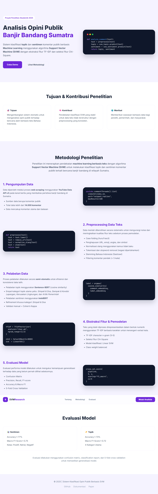

# 🧠 SVM Web App – Topic & Sentiment Analysis (Bahasa Indonesia)

Aplikasi web end-to-end untuk **analisis topik dan sentimen komentar berbahasa Indonesia** menggunakan **Support Vector Machine (SVM)**.  
Project ini mencakup proses **scraping data YouTube**, **preprocessing NLP**, **training model machine learning**, hingga **deployment ke website interaktif**.

---

## 📌 Gambaran Umum Alur Sistem

1. Scraping komentar YouTube (YouTube Data API v3)  
2. Preprocessing teks Bahasa Indonesia  
3. Pelabelan topik & sentimen  
4. Training model SVM  
5. Evaluasi model  
6. Penyimpanan model  
7. Deployment model ke web (Flask API)  
8. Visualisasi hasil analisis di website  

---
## 🖥️ Tampilan Website (Demo Aplikasi)

Berikut merupakan tampilan antarmuka website hasil implementasi model
klasifikasi topik dan sentimen berbasis **Support Vector Machine (SVM)**.

### 🔹 Halaman Beranda
<p align="center">
  
</p>

<sub><i>
Gambar 1. Tampilan halaman beranda sistem analisis opini publik banjir bandang Sumatra
</i></sub>

---
## 📥 1. Scraping Data (YouTube Data API v3)

### 🔹 Sumber Data
- **Platform**: YouTube (Channel Najwa Shihab)  
- **Data**: Komentar publik  
- **Topik**: Isu banjir bandang Aceh  
- **Bahasa**: Indonesia  

### 🔹 Metode
Scraping dilakukan menggunakan **YouTube Data API v3** untuk mengambil komentar dari **7 video** yang membahas bencana banjir bandang Aceh.

Dataset hasil scraping disimpan dalam format **CSV** untuk tahap preprocessing dan pemodelan.

---

## 🧹 2. Preprocessing Teks

Tahapan preprocessing bertujuan untuk membersihkan dan menormalkan teks sebelum dilakukan pemodelan.

### 🔹 Tahapan Preprocessing
1. Case folding  
2. Menghapus URL, mention, emoji, angka, dan simbol  
3. Normalisasi kata tidak baku (slang)  
4. Tokenizing 
5. Stopword removal (NLTK Indonesian stopwords)  
6. Stemming menggunakan **Sastrawi**   

---

## 🏷️ 3. Pelabelan Data

### 🔹 Label Topik
- Kritik Pemerintah  
- Dampak & Kondisi Lapangan  
- Kerusakan Lingkungan  
- Simpati & Doa  

### 🔹 Label Sentimen
- Positif  
- Negatif  
- Netral  

---

## 🤖 4. Feature Extraction & Selection

### 🔹 TF-IDF
- Analyzer: `char_wb`  
- N-gram: `(3,5)`  
- Sublinear TF  
- Pengaturan `min_df` dan `max_df` disesuaikan dengan dataset  

### 🔹 Feature Selection
- **Chi-Square (SelectKBest)**  
- Digunakan untuk mengurangi dimensi fitur agar model lebih efisien dan stabil  

---

## 🧠 5. Training Model Machine Learning

### 🔹 Algoritma
- **Support Vector Machine (LinearSVC)**  

### 🔹 Model Terpisah
- Model klasifikasi **Topik**  
- Model klasifikasi **Sentimen**  

### 🔹 Alasan Pemilihan SVM
- Cocok untuk data teks berdimensi tinggi  
- Stabil pada dataset menengah hingga besar  
- Umum digunakan dalam penelitian akademik  

---

## 📊 6. Evaluasi Model

Evaluasi model dilakukan menggunakan:
- Stratified train-test split  
- Classification Report (Precision, Recall, F1-score)  
- Confusion Matrix  

Evaluasi dilakukan **terpisah** untuk:
- Model Topik  
- Model Sentimen  

---

## 💾 7. Penyimpanan Model

Model disimpan menggunakan **Joblib** agar dapat digunakan kembali tanpa training ulang.

```text
backend/models/
├── topic/
│   ├── tfidf_topic.joblib
│   ├── chi2_topic.joblib
│   └── svm_topic.joblib
│
└── sentiment/
    ├── tfidf_sentiment.joblib
    ├── chi2_sentiment.joblib
    └── svm_sentiment.joblib
```

---

## 🌐 8. Deployment ke Website

### 🔹 Backend (Flask API)

Backend bertugas untuk:
- Memuat model SVM  
- Melakukan preprocessing input  
- Menyediakan endpoint prediksi  

#### Endpoint Utama
- `GET /` → Health check  
- `POST /predict-text` → Prediksi teks tunggal  
- `POST /predict-csv` → Prediksi batch CSV / Excel  

---

### 🔹 Frontend (Dashboard Web)

Frontend dibangun menggunakan:
- HTML  
- Tailwind CSS  
- JavaScript  

### 🔹 Fitur Dashboard
✅ Upload file CSV / Excel  
✅ Tabel hasil analisis (komentar, topik, sentimen)  
✅ Visualisasi interaktif distribusi topik & sentimen  

---

## 🗂️ Struktur Folder Project

```text
svm-web-app/
├── backend/
│   ├── app.py
│   ├── model_loader.py
│   ├── predict.py
│   ├── preprocessing.py
│   ├── models/
│   │   ├── topic/
│   │   └── sentiment/
│   └── resources/
│       └── kamuskatabaku.xlsx
│
├── frontend/
│   ├── index.html
│   └── analyze.html
│
├── modelling/
│   └── klasifikasi_topik_dan_sentimen.ipynb
│
├── requirements.txt
├── README.md
└── venv/
```

---

## ⚙️ Instalasi & Menjalankan Aplikasi

### 1️⃣ Clone Repository
```bash
git clone https://github.com/Hardikasetiyawann/svm-web-app.git
```

### 2️⃣ Buat & Aktifkan Virtual Environment
```bash
python -m venv venv
venv\Scripts\activate
```

### 3️⃣ Install Dependency
```bash
pip install -r requirements.txt
```

### 4️⃣ Jalankan Backend
```bash
cd backend
python app.py
```

Backend berjalan di:
```
http://127.0.0.1:5000
```

### 5️⃣ Jalankan Frontend
Buka file berikut di browser:
```
frontend/index.html
```

---

## 🎯 Use Case
- Analisis opini publik  
- Monitoring sentimen isu kebencanaan  
- Penelitian akademik / jurnal  

---

## 👤 Author

**Hardika Setiyawan**  
Program Studi Informatika – Konsentrasi Sistem Cerdas  
Indonesia 🇮🇩  

---

## 📜 License

Project ini dibuat untuk **keperluan akademik dan riset**.  
Silakan gunakan dengan menyertakan atribusi.
